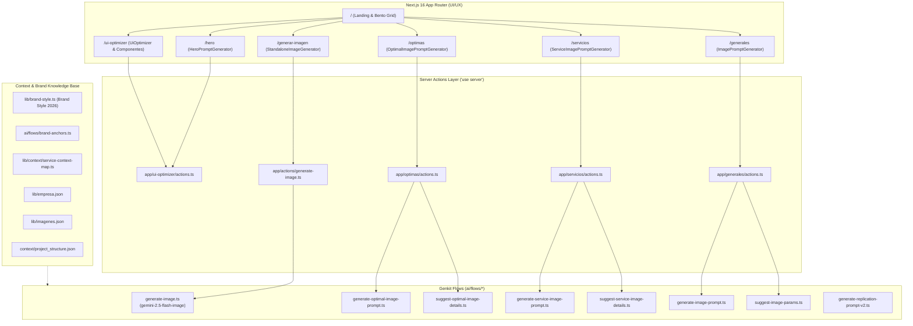

# Arquitectura y Documentación Técnica de Prompts e IA
**Proyecto:** Estudio de Creación de Imágenes & Prompts IA — *Envíos DosRuedas*  
**Stack Principal:** Next.js 16 (App Router), React 19, Google Genkit 1.42, `@genkit-ai/google-genai`, Tailwind CSS v4, TypeScript 7.  
**Modelos Activos:** `googleai/gemini-2.5-flash` (Generación de Prompts / Meta-prompting) y `gemini-2.5-flash-image` / Nano Banana (Renderizado directo de imágenes).

---

## 1. Resumen Ejecutivo

El sistema está diseñado como un **estudio de generación de assets visuales e ingeniería de prompts de alto impacto** para la marca de logística urbana **Envíos DosRuedas** (Mar del Plata, Argentina). 

La plataforma opera bajo dos paradigmas principales:
1. **Generación e Inferencia Directa (Text-to-Image):** Renderiza imágenes en tiempo real mediante `gemini-2.5-flash-image` (Nano Banana) con relaciones de aspecto configurables (`16:9`, `1:1`, `9:16`, `4:3`, `3:4`), control de errores en español y exportación en PNG/WebP.
2. **Meta-Prompting & AI Art Direction (Text-to-Prompt):** Un pipeline de asistencia en varias fases que utiliza `gemini-2.5-flash` para transformar intenciones de usuario, perfiles de servicios logísticos y código fuente en **prompts optimizados para modelos de difusión modernos** (Google Imagen 3, Nano Banana, Flux, SDXL) o en prompts de refactorización de código UI/UX.

---

## 2. Mapa Arquitectónico del Sistema



---

## 3. Anclas de Marca y ADN Visual (`BRAND_STYLE`)

Para garantizar consistencia visual en todas las generaciones de imagen sin alucinaciones de marca, el sistema inyecta tokens inmutables definidos en `src/lib/brand-style.ts` y `src/ai/flows/brand-anchors.ts`:

### Paleta Cromática Exacta
* **Deep Cobalt (Primario):** `#0636A5` / `rgb(6, 54, 165)`
* **Lemon Yellow / Safety-Yellow (Acento):** `#FFEC01` / `rgb(255, 236, 1)`
* **Brand Ink (Sombras/Textos profundos):** `#00277C`
* **Soft Blue Tint (Superficies/Fondos claros):** `#E6EEFE`

### Identidad Operativa Local
* **Ubicación Canónica:** Mar del Plata, Argentina (Hub Chauvín: *Friuli 1972*). Hitos urbanos: Rambla, Casino Central, Güemes, calles costeras.
* **Flota:** Scooters eléctricos celeste claro / azul con cajas de reparto cuadradas traseras.
* **Repartidores:** Polos Deep Cobalt (#0636A5) con vivos Lemon Yellow (#FFEC01), gorras amarillas y **casco de seguridad obligatorio** en todo prompt fotográfico.
* **Paquetería:** Cajas limpias de cartón kraft con detalles y cintas de la marca.

### Anclas de Estilo Estándar (Prompt Anchors)
```typescript
// 1. Fotografía Realista / Editorial
BRAND_PHOTO_ANCHOR = "Brand anchor: Envíos DosRuedas (Mar del Plata). Aesthetic: High-Velocity Cobalt, Safety-Yellow Impact, Digital Dispatch Modernism. Couriers wear Deep Cobalt navy polos (#0636A5) with Lemon Yellow trim (#FFEC01) and yellow caps. Fleet: light-blue urban scooters with square top delivery boxes. Parcels: clean kraft cardboard boxes. Natural Atlantic coastal sunlight (Mar del Plata landmarks or Friuli 1972 hub). Shot on Sony A7R IV / Canon EOS R5, documentary commercial realism, high resolution, no artificial logo renders."

// 2. Render 3D de Producto / Hero
BRAND_3D_ANCHOR = "Style anchor: Glossy 3D product render in Envíos DosRuedas brand style. Aesthetic: Kinetic Industrialism, High-Velocity Cobalt (#0636A5), Lemon Yellow (#FFEC01) accents, clean kraft cardboard, glossy light-blue surfaces. Soft upper-left studio illumination, subtle contact shadow, pure white cutout background (#FFFFFF). Rounded friendly proportions, ultra-realistic textures, no text."

// 3. Ilustración Isométrica 3D
BRAND_ISO_ANCHOR = "Style anchor: 30-degree isometric 3D architectural illustration in Envíos DosRuedas style. Pale-blue city blocks (#E6EEFE), white grid avenues, Deep Cobalt (#0636A5) and Lemon Yellow (#FFEC01) logistics nodes and route pathways. Pure white background, clean clay-like shading, high resolution."
```

---

## 4. Estructura y Filosofía de los Prompts (Nano Banana Standards)

Todos los flujos de generación de prompts siguen la metodología **Nano Banana** (Octubre 2025 / 2026):

1. **Estructura en Lenguaje Natural Continuo:** Quedan prohibidas las listas de palabras clave separadas por comas (ej. *"8k, masterpiece, trending on artstation"*). Se escriben oraciones fluidas, gramaticales y descriptivas de **80 a 120 palabras**.
2. **Fórmula Canónica de Construcción:**
   $$\text{[Categoría de Estilo]} + \text{[Tipo de Plano]} + \text{[Sujeto + Acción]} + \text{[Entorno/Hito]} + \text{[Iluminación + Clima/Mood]} + \text{[Especificaciones Técnicas (Lente, Apertura, Composición)]} + \text{[Ancla de Marca]} + \text{[Aspect Ratio]}$$
3. **Mapeo Técnico de Lentes y Cámaras:**
   | Estilo Visual | Categoría | Tipo de Plano | Lente / Apertura | Iluminación / Atmósfera |
   |---|---|---|---|---|
   | **Fotografía Urbana** | `Cinematic photography` | Cinematic wide shot | 35mm anamorphic, f/2.0 | Golden hour dramática, rim lighting en siluetas |
   | **Fotografía Realista** | `Photorealistic photography` | Medium shot | 50mm, f/2.8 (shallow DOF) | Luz solar natural costera, nítida |
   | **Arte 3D** | `3D product render` | Product hero shot | 100mm macro, f/11 (deep focus) | Soft upper-left studio con sombras de contacto |
   | **Ilustración Digital** | `Digital vector illustration` | Illustration | Vector art, N/A | Flat lighting con degradados suaves |
   | **Minimalista** | `Minimalist photography` | Clean product shot | 85mm, f/16 | Soft diffused studio, amplio espacio negativo |

4. **Reglas de Renderizado de Tipografía:**
   * Máximo 25 caracteres totales.
   * Especificación de tipografía de marca (`Anton`, `Bebas Neue`, `Geist Mono` u `Orbitron`) y posición exacta (`centered at bottom/top`).

---

## 5. Catálogo Detallado de Flujos Genkit

### 5.1 Flujo de Renderizado Directo: `generateImageFlow`
* **Archivo:** `src/ai/flows/generate-image.ts`
* **Entrada:** `prompt: string` (1–4000 caracteres), `aspectRatio: "16:9" | "1:1" | "9:16" | "4:3" | "3:4"`
* **Salida:** `imageDataUri: string` (Base64 data URI), `mimeType: string`
* **Mecanismo:** Invoca a `ai.generate` con `googleAI.model('gemini-2.5-flash-image')`, configurando `responseModalities: ['IMAGE']` e `imageConfig: { aspectRatio }`.

---

### 5.2 Generador de Prompts Generales: `generateImagePromptFlow`
* **Archivo:** `src/ai/flows/generate-image-prompt.ts`
* **Acción vinculada:** `generateImagePromptAction` en `src/app/generales/actions.ts`
* **Lógica:** Toma la sección (`Hero`, `Card`, `Banner`, `Ilustración`), el servicio asociado, relación de aspecto, estilo visual y campos opcionales (fondo, detalles adicionales, texto a incluir). Aplica el system prompt de director de arte y sintetiza el párrafo de 80-120 palabras.

---

### 5.3 Generador de Prompts de Servicios: `generateServiceImagePromptFlow`
* **Archivo:** `src/ai/flows/generate-service-image-prompt.ts`
* **Acción vinculada:** `generateServiceImagePromptAction` en `src/app/servicios/actions.ts`
* **Servicios Canónicos Soportados:**
  1. `envios-express` (Envíos Express inmediatos)
  2. `envios-lowcost` (Envíos económicos programados)
  3. `envios-flex` (Integración MercadoLibre Flex en el día)
  4. `plan-emprendedores` (Tarifas preferenciales e integraciones para e-commerce)
  5. `fulfillment-3pl` (Almacenamiento, pick & pack y distribución tercerizada)
* **Salida Estructurada:**
  ```json
  {
    "prompt": "Full English diffusion prompt...",
    "alt_es": "Texto alternativo accesible en español...",
    "filename_kebab": "envios-express-mar-del-plata.webp"
  }
  ```

---

### 5.4 Motor Asistido en 2 Fases: `suggestOptimalImageDetails` y `generateOptimalImagePrompt`
* **Archivos:** `src/ai/flows/suggest-optimal-image-details.ts` y `src/ai/flows/generate-optimal-image-prompt.ts`
* **Acción vinculada:** `src/app/optimas/actions.ts`
* **Fase 1 (Sugerencias):** Lee el contexto del servicio desde `lib/context/service-context-map.ts` y la empresa desde `lib/empresa.json`. Genera automáticamente:
  * 3 a 5 opciones creativas de **fondo** (ambientaciones en Mar del Plata, iluminación, paleta).
  * 3 a 5 opciones creativas de **contenido/sujeto** (acciones, poses, packaging, conductores con casco).
* **Fase 2 (Generación Final):** El usuario selecciona con botones de radio una sugerencia o escribe una variante personalizada. El flujo compila el prompt final resolviendo tipografías, relación de aspecto y textos de marca.

---

### 5.5 Flujos de Sugerencia Automática de Parámetros: `suggestImageParams` y `suggestServiceImageDetails`
* **Archivos:** `src/ai/flows/suggest-image-params.ts` y `src/ai/flows/suggest-service-image-details.ts`
* **Modos de Operación:**
  * **Modo Imagen de Inspiración:** Analiza perfiles existentes desde `lib/imagenes.json` (tags y descripciones) para sugerir sección, estilo, fondo y mejoras sin copiar defectos anteriores.
  * **Modo Contexto de Servicio:** Extrae los puntos clave de propuesta de valor y cobertura para sugerir el setting visual adecuado.

---

### 5.6 Meta-Prompting para Refactorización de UI y Componentes
* **Archivos:** `src/ai/flows/generate-replication-prompt-v2.ts`, `src/app/hero/page.tsx` y `src/app/ui-optimizer/page.tsx`
* **Propósito:** Genera prompts estructurados dirigidos a asistentes de programación (Claude, GPT-4, Gemini) para refactorizar código de la aplicación.
* **Estructura del Prompt Emitido:**
  1. Rol y directiva experta (Next.js 16 App Router, React 19, TypeScript, Tailwind CSS, ShadCN UI).
  2. Mapeo de archivos fuente seleccionados e inyección de código delimitado (`// --- INICIO: [path] ---`).
  3. Instrucciones de diseño **Mobile-first**, layout (Flex/Grid), eliminación de elementos nativos por primitivas ShadCN accesibles y preservación de Server Actions.

---

## 6. Ejemplos Reales de Prompts Generados

### Ejemplo 1: Fotografía Urbana / Envíos Express (Hero 16:9)
> *"Photorealistic medium shot of an Envíos DosRuedas courier in navy Deep Cobalt polo (#0636A5) with Lemon Yellow trim (#FFEC01) and yellow cap, wearing a sleek white safety helmet, riding a light-blue electric scooter with square delivery box along the Mar del Plata Rambla at golden hour. Warm coastal sunlight creates dramatic rim lighting on the courier's silhouette, evoking energetic reliability. Captured with 50mm f/2.8, shallow depth of field blurs the iconic Casino Central backdrop while keeping the courier and parcels in sharp focus. Rule of thirds composition places the rider entering from the left third. 16:9 cinematic format."*

### Ejemplo 2: Render 3D / Plan Emprendedores (Card 1:1)
> *"Glossy 3D product hero render in Envíos DosRuedas brand style. A miniature kraft cardboard shipping box with Lemon Yellow (#FFEC01) sealing tape resting on top of a sleek light-blue smartphone, surrounded by floating logistics map pins in Deep Cobalt (#0636A5). Soft upper-left studio illumination with subtle contact shadows on a pure white cutout background (#FFFFFF). Rounded friendly proportions, ultra-realistic textures, clean and modern aesthetic. 1:1 square format."*

---

## 7. Manejo de Errores y Seguridad en la Capa de Acciones

1. **Esquemas Zod Rigurosos:** Cada acción valida strings de entrada (`.trim()`, `.min(1)`, `.max(4000)`) y tipos enumerados en runtime.
2. **Aislamiento de Errores:** Las Server Actions capturan cualquier excepción y devuelven `{ error: string }` con mensajes localizados en español (`lib/image-generation-errors.ts`), evitando que el cliente experimente crashes o fugas de trazas internas.
3. **Protección Path Traversal:** Las acciones que leen archivos para el optimizador UI (`getFileContentAction` y `getComponentFilesContentAction`) resuelven rutas contra `process.cwd()` y verifican `absolutePath.startsWith(projectRoot)` antes de cualquier acceso al sistema de archivos.
